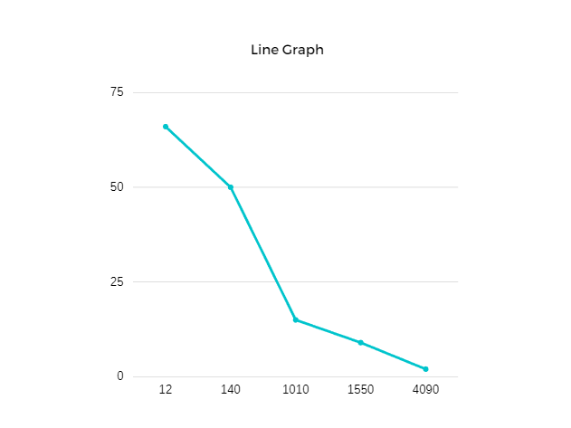

## Імітаційне моделювання комп'ютерних систем
## СПм-21-2, **Жуков Станіслав Валерійович**
### Лабораторная работа №**1**. Описание имитационных моделей

 

### Выбранная модель в среде NetLogo:
[Follower](http://www.netlogoweb.org/launch#http://www.netlogoweb.org/assets/modelslib/Sample%20Models/Art/Follower.nlogo)

 

### Вербальное описание модели:
Симуляция в которой черепахи пытаются «соединиться» с другими черепахами, образуя длинные цепочки в соответствии с небольшим набором простых правил.

### Управляющие параметры:
- **population** Указывает количество черепах, созданных в настройках.
- **near-radius** Внутренний радиус квадратного пончика, в котором ищут черепашки.
- **far-radius** Внешний радиус квадратного пончика, в котором ищут черепашки.
- **waver** Степень случайности в движении черепах, не следующих.

### Внутренние параметры:
- **leader**. Черепаха, за которой следует эта черепаха, или никто, если никто не зацепился.
- **follower**. Черепаха, которая следует за этой черепахой, или никто, если за ней не зацепились.

### Критерии эффективности системы:
- количество найденных приследователей черепах.
- средний расмер популяции.
- эффективность найденных преследователей .

### Примечания:
При настройках по умолчанию чрепехи находяд себе преследователя в течение 4-5 секунд.

### Недостатки модели:
При не большой настройки популяции церепах и внешнего радиуса, черепахт долго не могут найти преследователя. 
Возможность выставить неподходящее количество черепах.

 

## Вычислительные эксперименты

### 1. Влияние популяции на быстроту нахождения преследователей.
Изучаем зависимость от уменьшения и увеличения населения черепах. На сколько быстро черепахи соединяются. 

<table>
<thead>
<tr><th>Число черепах</th><th>Время соединения</th></tr>
</thead>
<tbody>
<tr><td>12</td><td>300</td></tr>
<tr><td>140</td><td>240</td></tr>
<tr><td>1010</td><td>200</td></tr>
<tr><td>1550</td><td>160</td></tr>
<tr><td>4090</td><td>115</td></tr>
</tbody>
</table>

 
График наглядно показывает, что увеличение нселения черепах, уменьшает время соединения черепах.
### 2.  .
...
### 3. Влияние на увеличение популяции черепах для нахождения преследователей.
Изучаем зависимость от уменьшения и увеличения населения черепах. На сколько быстро черепахи находят преследователя. 

<table>
<thead>
<tr><th>Число черепах</th><th>Время нахождения преследователя</th></tr>
</thead>
<tbody>
<tr><td>12</td><td>300</td></tr>
<tr><td>140</td><td>240</td></tr>
<tr><td>1010</td><td>200</td></tr>
<tr><td>1550</td><td>160</td></tr>
<tr><td>4090</td><td>115</td></tr>
</tbody>
</table>

 
График наглядно показывает, что увеличение нселения черепах, уменьшает время соединения черепах.
