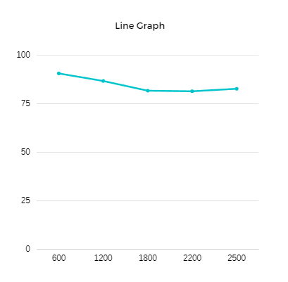

## Імітаційне моделювання комп'ютерних систем
## СПм-21-2, **Жуков Станіслав Валерійович**
### Лабораторная работа №**1**. Описание имитационных моделей

 

### Выбранная модель в среде NetLogo:
[Segregation](http://www.netlogoweb.org/launch#http://www.netlogoweb.org/assets/modelslib/IABM%20Textbook/chapter%203/Segregation%20Extensions/Segregation%20Simple%20Extension%201.nlogo)

 

### Вербальное описание модели:
Проект моделирует поведение черепах разных национальностей в мифическом пруду. Все черепахи ладят друг с другом. Но каждая черепаха хочет сделать так, чтобы рядом с ней жили какие-то «свои». Моделирование показывает, как эти индивидуальные предпочтения распространяются по всему пруду, приводя к крупномасштабным закономерностям.

### Управляющие параметры:
- **number** Указывает общее количество черепах, созданных в настройках.
- **%-similar-wanted** Управляет процентом черепашек того же цвета, которые каждая черепаха хочет видеть среди своих соседей.
- **number-of-ethnicities** Управляет количеством различных типов черепах, каждый из которых имеет свой цвет.

### Внутренние параметры:
- **percent-similar**. В среднем, какой процент соседей черепахи, такого же цвета, как эта черепаха.
- **percent-unhappy **. Процент недовольных черепах.
- **colors**. Список цветов, которые используют для окраски черепах

### Критерии эффективности системы:
- Количество созданых черепах.
- Количество черепах с такой же национальностью.
- Общее количество национальности.

### Примечания:
Несчастные черепахи прыгают в новые места поблизости. Но в новых местах они могут нарушить баланс местного населения, что побудит других черепах уйти.

### Недостатки модели:
При выставление "%-similar-wanted" на 100% проект будет бесконечен.

 

## Вычислительные эксперименты

### 1. Влияние значения "%-SIMILAR-WANTED" на изменение общей степени сегрегации.
Изучаем влияния параметра "%-SIMILAR-WANTED", как он будет влиять на общее переселение черепах. Количество черепах = 2000 Количество рас = 3.

<table>
<thead>
<tr><th>similar-wanted</th><th>Время выполнения модели</th></tr>
</thead>
<tbody>
<tr><td>0</td><td>0</td></tr>
<tr><td>15</td><td>13</td></tr>
<tr><td>30</td><td>32</td></tr>
<tr><td>45</td><td>42</td></tr>
<tr><td>60</td><td>123</td></tr>
<tr><td>75</td><td>∞</td></tr>

</tbody>
</table>

Таблица показывает, что процент similar-wanted влияет на выполнение модели по стандартным правилам. При увеличение показателя, увеличивается выполнение модели до бесконечности.

### 2. Влияние управлением количеством различных типов черепах на быстроту выполнения модели.
Изучаем влияние количества различных типов черепах на быстроту выполнения модели. Количество черепах = 2000 %-SIMILAR-WANTED = 30.

<table>
<thead>
<tr><th>Количество рас</th><th>Время выполнения модели</th></tr>
</thead>
<tbody>
<tr><td>2</td><td>12</td></tr>
<tr><td>3</td><td>26</td></tr>
<tr><td>4</td><td>31</td></tr>
<tr><td>5</td><td>42</td></tr>
</tbody>
</table>

 
 
График показывет, что при увеличение рас, увеличивается выполнение данной модели.

### 3. Влияние "%-SIMILAR-WANTED" на процент похожих черепах рядом.
Изучаем, что если каждая черепаха хочет иметь как минимум 40% соседей той же этнической принадлежности то какой процент похожих черепах рядом они получат? %-SIMILAR-WANTED = 40%.

<table>
<thead>
<tr><th>Количество черепах</th><th>Процент похожих</th></tr>
</thead>
<tbody>
<tr><td>600</td><td>90.6</td></tr>
<tr><td>1200</td><td>86.7</td></tr>
<tr><td>1800</td><td>81.4</td></tr>
<tr><td>2200</td><td>81.1</td></tr>
<tr><td>2500</td><td>82.7</td></tr>
</tbody>
</table>

График показывает, что при увеличение количества черепах, уменьшается процент похожих черепах.
