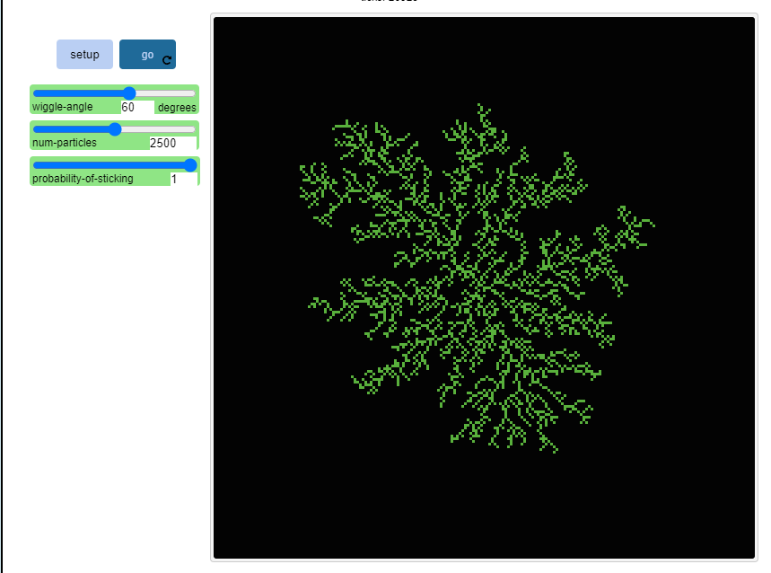
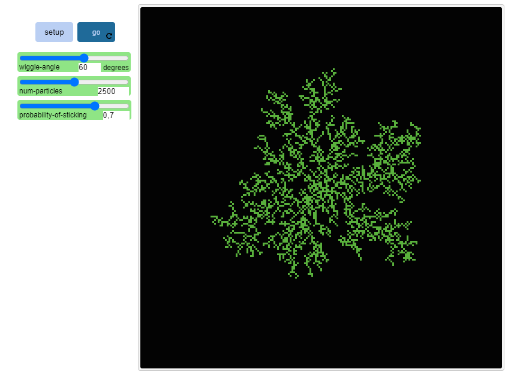
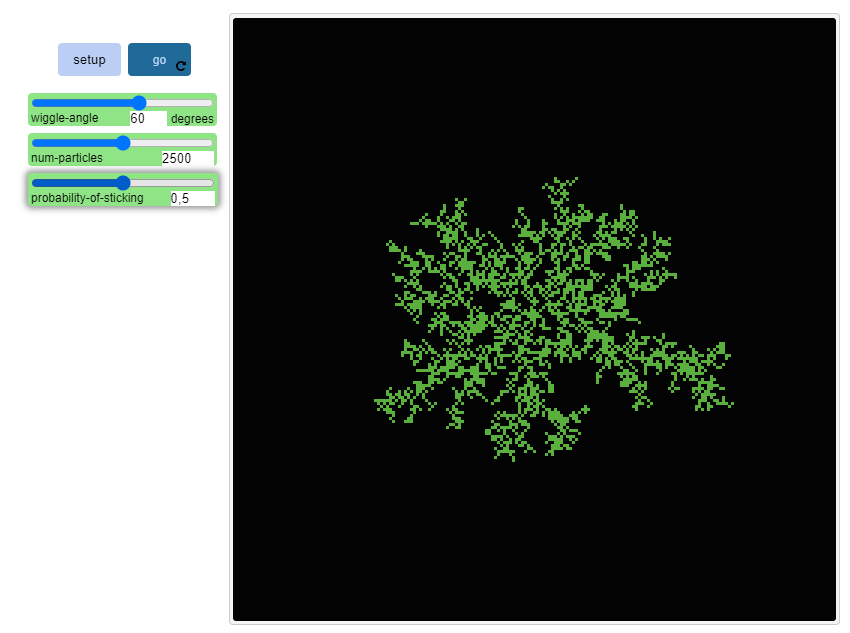
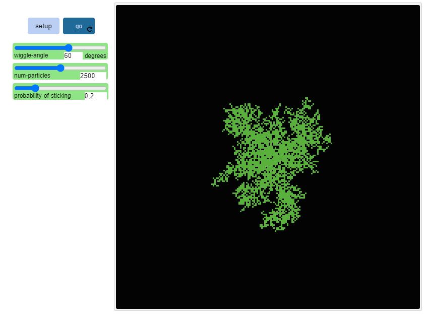
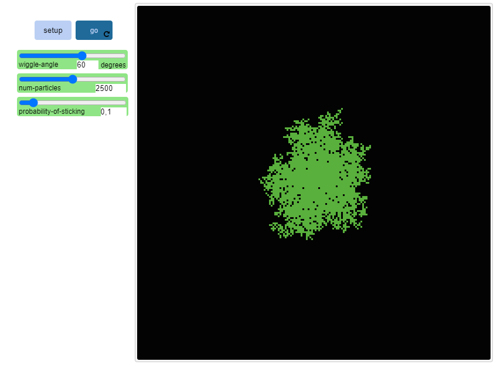

## Імітаційне моделювання комп'ютерних систем
## СПм-21-2, **Жуков Станіслав Валерійович**
### Лабораторная работа №**1**. Описание имитационных моделей

 

### Выбранная модель в среде NetLogo:
[DLA Simple Extension 1](http://www.netlogoweb.org/launch#http://www.netlogoweb.org/assets/modelslib/IABM%20Textbook/chapter%203/DLA%20Extensions/DLA%20Simple%20Extension%201.nlogo)

 

### Вербальное описание модели:
Симуляция в которой демонстрируется как движущиеся частицы по случайным траекториям, слипаются, образуя красивые древовидные ветвящиеся структуры.

### Управляющие параметры:
- **num-particles** Указывает количество частиц, созданных в настройках.
- **wiggle-angle** Определяет, насколько извилистыми будут траектории, по которым следуют частицы.
- **probability-of-sticking** Управляет вероятностью того, что частица, столкнувшаяся с заполнителем, погибнет там и прибавится к заполнителю.

### Внутренние параметры:
- **random-xcor**. Сообщает случайное число с плавающей запятой из допустимого диапазона координат черепахи по заданной оси x.
- **random-ycor**. Сообщает случайное число с плавающей запятой из допустимого диапазона координат черепахи по заданной оси y.

### Критерии эффективности системы:
- количество выставленных частиц.
- выставленный параметр вероятности прилипания.

### Примечания:
При настройках вероятности прилипания на максимум, вырисовывается силуэт снежинки.

### Недостатки модели:
При настройках вероятности прилипания на минимум, частицы не будут склеиваться.

 

## Вычислительные эксперименты

### 1. Влияние угла поворота на быстроту выполнения модели.
Изучаем зависимость от узменения угла поворота. На сколько быстро выполняется модель. 

<table>
<thead>
<tr><th>Угол поворота</th><th>Время выполнения модели</th></tr>
</thead>
<tbody>
<tr><td>0</td><td>∞</td></tr>
<tr><td>30</td><td>285</td></tr>
<tr><td>60</td><td>700</td></tr>
<tr><td>100</td><td>1300</td></tr>
</tbody>
</table>

 
Таблица наглядно показывает, что при выставление угла поворота на "0", окончание модели не будет, а при увеличение угла поворта от 30 до 100, время выполнения модели увеличивается.

### 2. Влияние вероятности прилипания на быстроту выполнения модели.
Изучаем влияние вероятности прилипания на быстроту выполнения модели.

<table>
<thead>
<tr><th>вероятность прилипания</th><th>Время выполнения модели</th></tr>
</thead>
<tbody>
<tr><td>0</td><td>∞</td></tr>
<tr><td>0.1</td><td>1160</td></tr>
<tr><td>0.3</td><td>650</td></tr>
<tr><td>0.5</td><td>550</td></tr>
<tr><td>0.8</td><td>450</td></tr>
<tr><td>1</td><td>400</td></tr>
</tbody>
</table>

Таблица показывает, что увеличение вероятности прилипания, уменьшает время выполнения модели. Кроме первого варианта, он будет выполняться бесконечно.

### 3. Влияние вероятности прилипания на на окончательный силуэт модели.
Изучаем влияние вероятности прилипания на на окончательный силуэт модели (На мое мнение). 
 
Силуэт при вероятности прилипания равной 1.
 

 
Силуэт при вероятности прилипания равной 0.7.

 
Силуэт при вероятности прилипания равной 0.5.

 
Силуэт при вероятности прилипания равной 0.2.

 
Силуэт при вероятности прилипания равной 0.1.

 

 
Скриншоты показывают, что при увеличение вероястности прилипания, силуэт получается более красивее и больше. 
